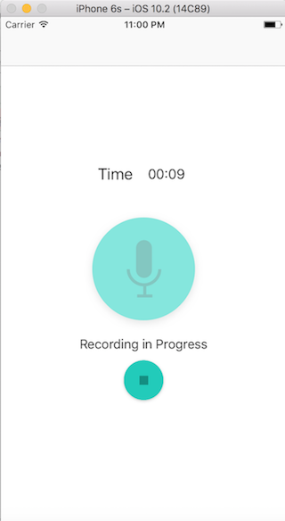

# PitchPerfect_sy
### SUMMARY
>This is my first iOS Application in Swift.  

PitchPerfect is an app that record user's voice with using AVAudioRecorder and play back sound with 6 different effects. For addtional features, used AVAudioPlayer for show duration of the recorded audio and show pregressview as well.

There are two main functions and additional features added for this app.  

---
## Main Functions.  
1. Record Sound.    
   By tapping microphone image, the recording begins.

2. Play the recorded Sound back with 6 different effects.  
  * high-pitch sound
  * low-pitch sound
  * slow sound
  * fast sound
  * reverb sound
  * echo sound

---
## Screenshots
 

---
## Additional Features. 
* Shows recording time while recording in RecordSoundViewController.
* Shows remain time within progressview while playing recorded sound in PlaySoundViewController.  

--
## Demo Video Link . 
[PitchPerctApp](https://www.youtube.com/watch?v=Z5eMroswM-c)

